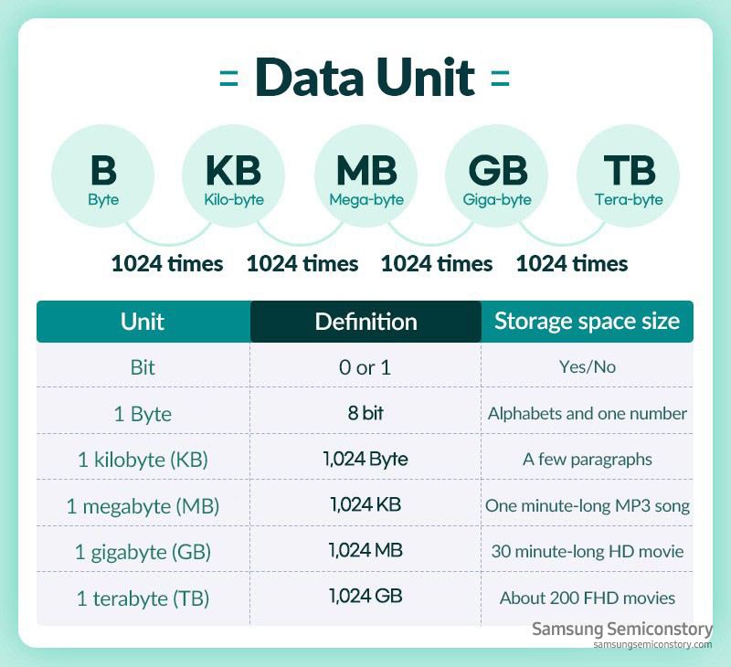

# 前提知識

## データの単位

現在データの基本的な単位として使われている Byte は、Bit（データの最小構成単位）が8個集まったものです。  


より大きなデータの単位には

- KB（キロバイト）
- MB（メガバイト）
- GB（ギガバイト）
- TB（テラバイト）
- PB（ペタバイト）
- EB（エクサバイト）
- ZB（ゼタバイト）
- YB（ヨタバイト）

があります。  
一般的な単位体系では、単位の接頭文字は 1,000(10^3) ごとに切り替わります。
しかしデータ単位は 1,024(2^10) ごとに接頭文字を使い分けます。これは情報を表現する際、10進数よりも2進数の方が都合がよいためです。



## bit演算（左シフト）

ビット演算の左シフトとは、bit列に格納されているデータを指定した数だけ左にシフトする操作です。  
シフトする数だけ、bit列の左端から順番にデータを取り除き、右端に0を挿入します。  

```
┌-------------------┐
|   2進数   | 10進数 |
|==========+========|
| 00001101 |   13   |  ┐
|----------+--------|  | 左へ 2bit シフト
| 00110100 |   52   | <┘
└-------------------┘
```

これをGoで表現すると、このようになります。

```go
package main

import "fmt"

func main() {
    x, n := 13, 2

    fmt.Println(x<<n) // 52
}
```

左シフトすることで、値 x を 2^n 倍していることが分かります。

## まとめ

ここまでの知識を合わせると、このコードを理解することができます。

```go
package main

import "fmt"

func main() {
    kb := 1024
    mb := kb * 1024

    fmt.Println(mb == kb<<10) // true
}
```

##### 画像利用
[バイト(Byte) | サムスン半導体日本](https://semiconductor.samsung.com/jp/support/tools-resources/dictionary/bits-and-bytes-units-of-data/)