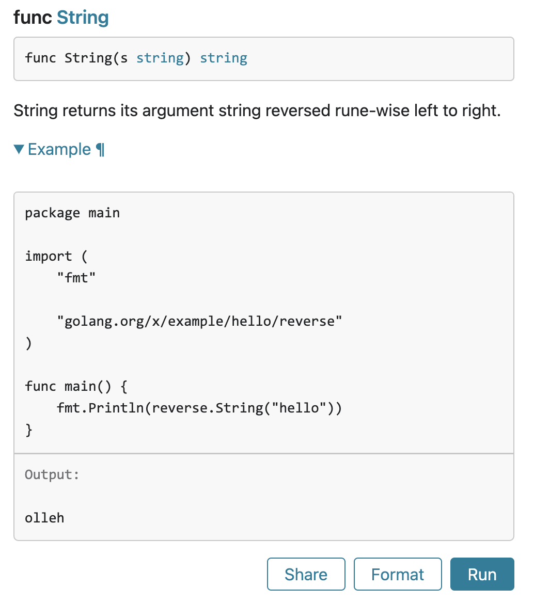

# Go におけるテスト可能な Examples

*Andrew Gerrand*  
*2015年 5月 7日*

### はじめに

Godoc において、[Examples](https://pkg.go.dev/testing#hdr-Examples) はパッケージのドキュメントとして表示され、テストとして実行することで検証される Go のコードの一部です。また、ユーザーがパッケージの godoc のウェブページにアクセスし、「実行」ボタンをクリックすることによっても実行できます。  
  
パッケージの実行可能なドキュメントを持つことで、APIが変更されても情報が古くならないことが保証されます。  
  
標準ライブラリには、このような Examples が数多く含まれています（例えば、[strings package](https://pkg.go.dev/strings#Contains) が挙げられます）。  
  
この記事では、どのようにあなた自身の example 関数を作成するのかについて説明します。

### Examples とはテストである

Examples は、パッケージにおける一連のテストの一部としてコンパイルされます。  
  
一般的なテストと同様に、Examples はパッケージの _test.go ファイルに存在する関数です。しかし、通常のテスト関数とは異なり、Example 関数は引数を持たず、Test ではなく Example で始まります。  
  
[reverse package](https://pkg.go.dev/golang.org/x/example/hello/reverse) は [Go example repository](https://cs.opensource.google/go/x/example) の一部です。String 関数の例を示します。

```go
package reverse_test

import (
    "fmt"

    "golang.org/x/example/hello/reverse"
)

func ExampleString() {
    fmt.Println(reverse.String("hello"))
    // Output: olleh
}
```

このコードは、reverse ディレクトリ内の example_test.go 内にあります。  
  
Go パッケージのドキュメントサーバーである pkg.go.dev では、[String 関数のドキュメント](https://pkg.go.dev/golang.org/x/example/hello/reverse#String)と共に、この Example を紹介しています。  



パッケージのテストを実行すると、Example の関数がそれ以上何もしなくても実行されていることがわかります。

```bash
$ go test -v
=== RUN   TestString
--- PASS: TestString (0.00s)
=== RUN   ExampleString
--- PASS: ExampleString (0.00s)
PASS
ok      golang.org/x/example/hello/reverse  0.209s
```

### Output コメント

ExampleString 関数が合格（PASS）するとは、どういう意味でしょう？  
  
Example を実行すると、テストフレームワークは標準出力に書き込まれたデータをキャプチャし、その出力を Example の「Output:」コメントと比較します。そして、テストの出力と Output コメントが一致した場合、テストに合格するのです。  

失敗例を見るために、出力されるコメントテキストを明らかに誤っているものに変えてみましょう。

```go
func ExampleString() {
    fmt.Println(reverse.String("hello"))
    // Output: golly
}
```

再度、テストを実行します。

```bash
$ go test
--- FAIL: ExampleString (0.00s)
got:
olleh
want:
golly
FAIL
```

Outputコメントを全て取り除いた場合、

```go
func ExampleString() {
    fmt.Println(reverse.String("hello"))
}
```

Example 関数はコンパイルされますが、実行はされません。

```bash
$ go test -v
=== RUN   TestString
--- PASS: TestString (0.00s)
PASS
ok      golang.org/x/example/hello/reverse  0.110sr
```

Output コメントのない Example は、少なくともコンパイル可能であることを保証しながら、ネットワークにアクセスするようなユニットテストとして実行できないコードを表すのに便利です。

### Example 関数の命名

Godoc では、Example 関数とパッケージ・レベルの識別子を関連付けるための、命名規則を使用しています。

```go
func ExampleFoo()     // documents the Foo function or type
func ExampleBar_Qux() // documents the Qux method of type Bar
func Example()        // documents the package as a whole
```

この慣例に従って、godoc は String 関数のドキュメントと一緒に ExampleString の例を表示します。  
  
アンダースコアで始まり、小文字が続くサフィックスを使用することで、与えられた識別子に対して複数の例を提供することができます。これらの例は、それぞれ String 関数をドキュメント化したものです。

```go
func ExampleString()
func ExampleString_second()
func ExampleString_third()
```

### より広範な Example

良い Example を書くためには、関数以上のものが必要なこともあります。  
  
例えば、[sort パッケージ](https://pkg.go.dev/sort)を表現するには、sort.Interface の実装を示す必要があります。メソッドは関数本体の中で宣言することはできないので、Example には Example 関数に加えて何らかのコンテキストを含める必要があります。  
  
これを実現するには、「全ファイル Example (whole file example.)」を使用します。ファイル全体の例とは、_test.goで終わり、ちょうど1つの Example 関数を含み、テスト関数やベンチマーク関数を含まず、少なくとも1つの他のパッケージレベルの宣言を含むファイルのことです。このような例を表示する場合、godoc はファイル全体を表示します。  
  
以下は、sort パッケージにおける、全ファイル Example の例です。

```go
package sort_test

import (
    "fmt"
    "sort"
)

type Person struct {
    Name string
    Age  int
}

func (p Person) String() string {
    return fmt.Sprintf("%s: %d", p.Name, p.Age)
}

// ByAge implements sort.Interface for []Person based on
// the Age field.
type ByAge []Person

func (a ByAge) Len() int           { return len(a) }
func (a ByAge) Swap(i, j int)      { a[i], a[j] = a[j], a[i] }
func (a ByAge) Less(i, j int) bool { return a[i].Age < a[j].Age }

func Example() {
    people := []Person{
        {"Bob", 31},
        {"John", 42},
        {"Michael", 17},
        {"Jenny", 26},
    }

    fmt.Println(people)
    sort.Sort(ByAge(people))
    fmt.Println(people)

    // Output:
    // [Bob: 31 John: 42 Michael: 17 Jenny: 26]
    // [Michael: 17 Jenny: 26 Bob: 31 John: 42]
}
```

ひとつのパッケージには、複数の全ファイル Example を含むことができます（ただし、ひとつのファイルにつき Example もひとつです）。実例としては、[sort パッケージのソースコード](https://go.dev/src/sort/)をご覧ください。

### まとめ

Godoc の Example は、ドキュメントとしてコードを書き、維持するための素晴らしい方法です。また、編集可能で、動作し、実行可能なサンプルを提示し、ユーザーがそれを基に構築することができます。ぜひ使ってみてください！

#### 原文
[go.dev/blog/examples](https://go.dev/blog/examples)